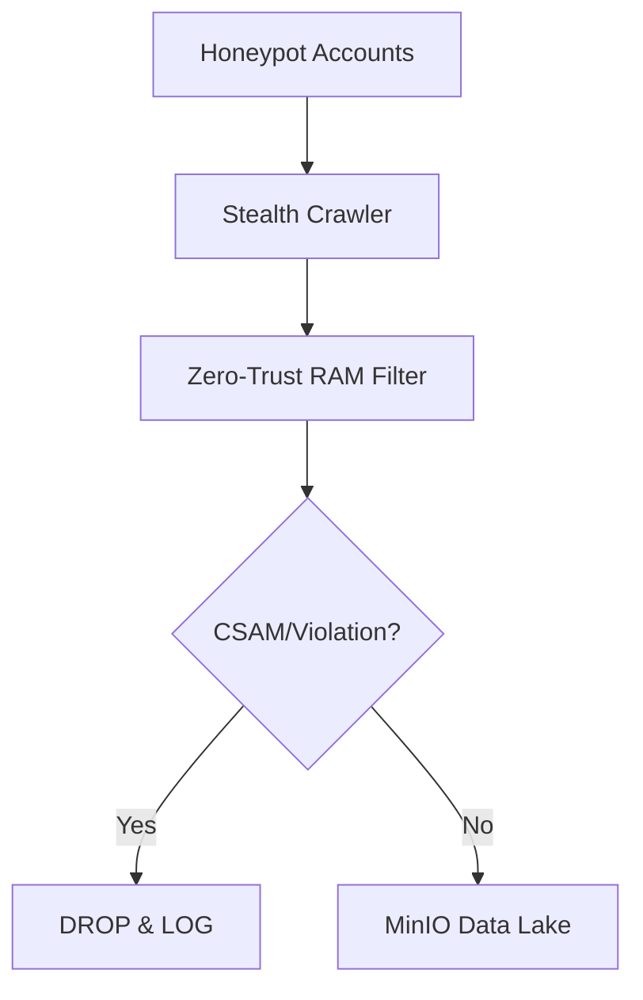
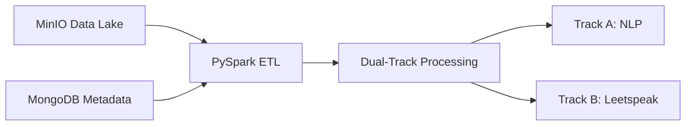
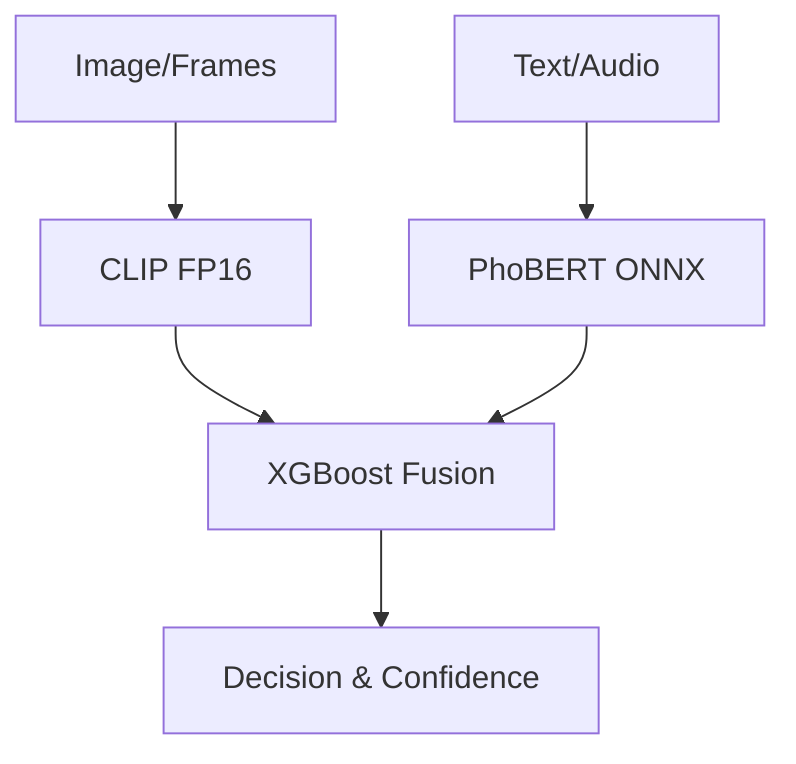
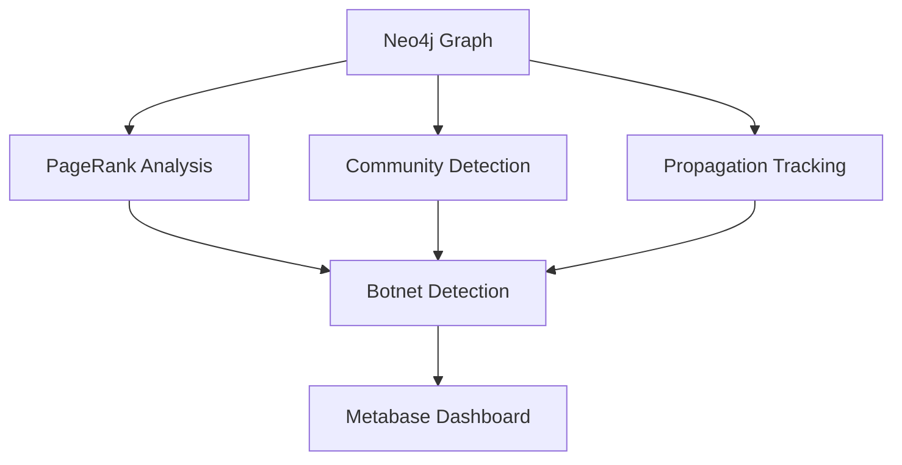
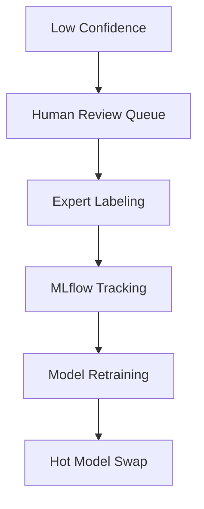
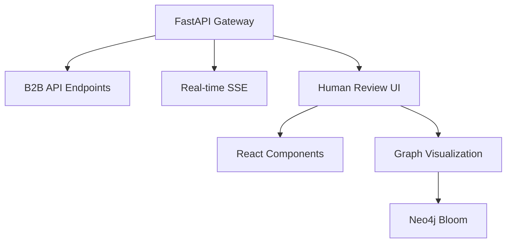
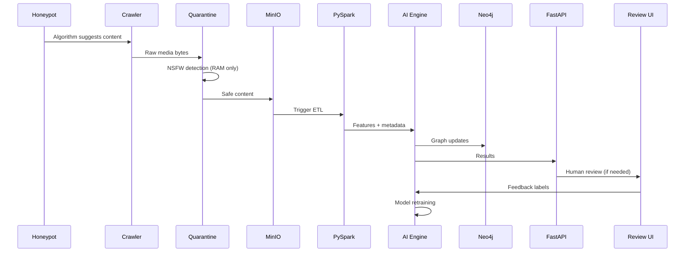
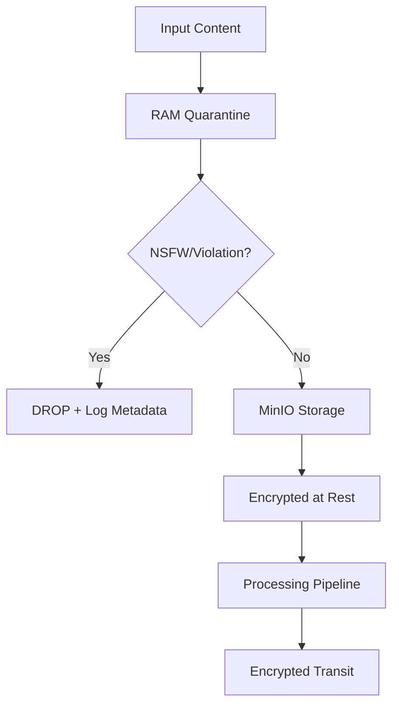

# 🏗️ ViFake Analytics - Architecture Overview

## 📋 Table of Contents

1. [System Vision](#1-system-vision)
2. [Architecture Principles](#2-architecture-principles)
3. [6-Tier Architecture](#3-6-tier-architecture)
4. [Technology Stack](#4-technology-stack)
5. [Data Flow](#5-data-flow)
6. [Security Architecture](#6-security-architecture)
7. [Scalability & Performance](#7-scalability--performance)
8. [Deployment Architecture](#8-deployment-architecture)

---

## 1. System Vision

### Mission Statement
> Phát hiện, phân tích và truy vết nội dung AI-generated độc hại nhắm vào trẻ em trên mạng xã hội — chạy **hoàn toàn local**, xuất API cho B2B2C.

### Key Objectives
- **Real-time detection** of harmful AI-generated content
- **Multi-modal analysis** (text, image, video)
- **Graph-based propagation tracking**
- **Active learning** with human review
- **B2B API integration** for partners

---

## 2. Architecture Principles

### 🔒 Zero-Trust Security
- **No persistent storage** of harmful content
- **In-memory quarantine** before processing
- **Encrypted data** in transit and at rest
- **Audit logging** for compliance

### 🚀 Performance First
- **GPU-accelerated** AI inference (RTX 2050)
- **Parallel processing** with PySpark
- **Caching layers** (Redis)
- **Batch optimization** for throughput

### 🔄 Active Learning Loop
- **Human-in-the-loop** review process
- **Continuous model improvement**
- **Confidence-based routing**
- **Automated retraining** triggers

### 🕸️ Graph-Centric Analytics
- **Neo4j propagation networks**
- **Botnet detection** algorithms
- **Real-time visualization**
- **Cross-platform analysis**

---

## 3. 6-Tier Architecture

### 📥 Tier 1: Data Ingestion & Quarantine
**Owner:** Data Engineer (Member 1)



**Components:**
- **Honeypot Accounts**: Fake child profiles (age 8-12)
- **Stealth Crawler**: Playwright with Gaussian delays
- **Quarantine Filter**: NSFW detection on RAM only
- **Anti-Ban Strategy**: Profile rotation, rate limiting

### 🗄️ Tier 2: Local Big Data Stack
**Owner:** Data Engineer (Member 1)



**Components:**
- **MinIO**: S3-compatible object storage
- **MongoDB**: Metadata store with indexes
- **PySpark**: Dual-track ETL pipeline
- **PostgreSQL**: Data mart for analytics

### 🤖 Tier 3: Multi-modal AI Engine
**Owner:** AI/ML Engineer (Member 2)



**Components:**
- **Vision Worker**: CLIP FP16 on RTX 2050 (4GB VRAM)
- **NLP Worker**: PhoBERT ONNX + RAG vector search
- **Fusion Model**: XGBoost meta-learner
- **Active Learning**: Confidence-based routing

### 🕸️ Tier 4: Graph Analytics & Visualization
**Owner:** Graph Analyst (Member 3)



**Components:**
- **Neo4j**: Propagation network storage
- **Graph Algorithms**: PageRank, Louvain, similarity
- **Metabase**: Real-time dashboard
- **Neo4j Bloom**: Interactive visualization

### 🔄 Tier 5: Active Learning & MLOps
**Owner:** AI/ML Engineer (Member 2)



**Components:**
- **Review Queue**: MongoDB-based task queue
- **MLflow**: Experiment tracking
- **Auto Retraining**: Trigger-based model updates
- **Model Registry**: Versioned model storage

### 🌐 Tier 6: Backend API & Human Review UI
**Owner:** Full-stack Developer (Member 4)



**Components:**
- **FastAPI**: High-performance API gateway
- **React UI**: Human review interface
- **SSE Streaming**: Real-time progress updates
- **Dashboard Integration**: Metabase + Neo4j

---

## 4. Technology Stack

### 🐍 Python Backend
```python
# Core Framework
fastapi==0.104.0          # API framework
uvicorn==0.24.0           # ASGI server
pydantic==2.5.0           # Data validation

# AI/ML
torch==2.1.0              # Deep learning
transformers==4.36.0      # Hugging Face
xgboost==2.0.0           # Gradient boosting
optimum[onnxruntime]==1.16.0  # ONNX optimization

# Big Data
pyspark==3.5.0            # Distributed processing
pandas==2.1.4             # Data manipulation
numpy==1.24.3             # Numerical computing

# Databases
pymongo==4.6.0            # MongoDB
asyncpg==0.29.0           # PostgreSQL
neo4j==5.15.0             # Neo4j graph
redis==5.0.1              # Cache
```

### 🐳 Docker & Infrastructure
```yaml
services:
  mongodb:     mongo:7.0
  postgres:    postgres:15
  neo4j:       neo4j:5.15-community
  minio:       minio/minio:latest
  redis:       redis:7-alpine
  metabase:    metabase/metabase:latest
  mlflow:      python:3.11-slim
```

### ⚛️ Frontend
```json
{
  "framework": "React 18",
  "ui": "Material-UI v5",
  "charts": "D3.js + Plotly",
  "state": "React Context",
  "http": "Axios"
}
```

---

## 5. Data Flow

### 🔄 End-to-End Pipeline



### 📊 Data Pipeline Stages

1. **Collection**: Honeypot crawling with stealth
2. **Quarantine**: RAM-based content filtering
3. **Storage**: Safe content to MinIO + MongoDB
4. **Processing**: PySpark dual-track ETL
5. **Analysis**: Multi-modal AI inference
6. **Graphing**: Neo4j network updates
7. **Visualization**: Real-time dashboards
8. **Learning**: Human feedback integration

---

## 6. Security Architecture

### 🛡️ Zero-Trust Model



### 🔐 Security Layers

| Layer | Protection | Implementation |
|---|---|---|
| **Input** | Content validation | Pydantic models, input sanitization |
| **Storage** | Encryption at rest | MinIO encryption, MongoDB auth |
| **Transit** | TLS encryption | HTTPS, WSS, internal TLS |
| **Access** | Authentication | JWT tokens, API keys |
| **Audit** | Logging | Structured logging, audit trails |

### 🚨 Violation Handling

```python
# Zero-Trust quarantine logic
def quarantine_content(content_bytes: bytes) -> dict:
    # 1. NSFW detection on RAM only
    nsfw_result = detect_nsfw(content_bytes)
    
    if nsfw_result.is_violating:
        # 2. Log metadata only (NO content storage)
        log_violation(
            reason=nsfw_result.reason,
            confidence=nsfw_result.confidence,
            timestamp=utcnow()
        )
        return {"action": "DROP", "reason": nsfw_result.reason}
    
    # 3. Pass to storage if safe
    return {"action": "PASS", "reason": "clean"}
```

---

## 7. Scalability & Performance

### 📈 Performance Targets

| Component | Target | Current |
|---|---|---|
| **API Response** | <500ms | TBD |
| **Vision Inference** | <200ms | TBD |
| **NLP Inference** | <100ms | TBD |
| **Graph Query** | <2s | TBD |
| **Dashboard Load** | <5s | TBD |
| **Concurrent Users** | 100+ | TBD |

### 🚀 Optimization Strategies

#### GPU Memory Management
```python
# CLIP FP16 optimization
@torch.no_grad()  # Disable gradients
def classify_image(image_path: str) -> dict:
    img = Image.open(image_path).convert("RGB")
    img.thumbnail((336, 336))  # Resize before model
    
    inputs = processor(text=CANDIDATE_LABELS, images=img, return_tensors="pt")
    outputs = model(**inputs)
    
    # Explicit cleanup
    del inputs, outputs
    torch.cuda.empty_cache()
    gc.collect()
```

#### Parallel Processing
```python
# PySpark distributed processing
spark = SparkSession.builder \
    .config("spark.driver.memory", "8g") \
    .config("spark.executor.memory", "10g") \
    .config("spark.sql.shuffle.partitions", "200") \
    .getOrCreate()

# Process 1000 posts in parallel
df = spark.read.json("s3://raw-media/batch/")
results = df.repartition(100).mapPartitions(process_batch)
```

#### Caching Strategy
```python
# Redis multi-layer cache
@lru_cache(maxsize=1000)
def get_cached_analysis(post_id: str):
    # L1: Python memory cache
    pass

def get_redis_cache(key: str):
    # L2: Redis distributed cache
    return redis_client.get(key)

def get_model_inference(features: dict):
    # L3: Model prediction cache
    cache_key = hash_dict(features)
    cached = get_redis_cache(f"model:{cache_key}")
    return cached if cached else predict(features)
```

---

## 8. Deployment Architecture

### 🐳 Docker Compose Layout

```yaml
# 3-tier network isolation
networks:
  vifake-network:
    driver: bridge
    ipam:
      config:
        - subnet: 172.20.0.0/16

# Service dependencies
services:
  api-gateway:
    depends_on:
      - mongodb
      - postgres
      - redis
      - neo4j
      - minio
    deploy:
      resources:
        reservations:
          devices:
            - driver: nvidia
              count: 1
              capabilities: [gpu]
```

### 🔄 CI/CD Pipeline

```yaml
# GitHub Actions workflow
name: ViFake Analytics CI/CD
on:
  push:
    branches: [main, develop]

jobs:
  test:
    runs-on: ubuntu-latest
    steps:
      - uses: actions/checkout@v3
      - name: Run tests
        run: |
          docker-compose up -d test-db
          pytest tests/ --cov=src/
  
  deploy:
    needs: test
    runs-on: ubuntu-latest
    steps:
      - name: Deploy to production
        run: |
          docker-compose down
          docker-compose up -d --build
```

### 📊 Monitoring Stack

| Service | Purpose | Port |
|---|---|---|
| **Prometheus** | Metrics collection | 9090 |
| **Grafana** | Visualization | 3002 |
| **MLflow** | ML experiment tracking | 5001 |
| **Metabase** | Business analytics | 3001 |
| **Neo4j Bloom** | Graph visualization | 7474 |

---

## 🎯 Architecture Decisions

### ✅ Chosen Approaches

1. **Local-first**: No cloud dependencies for data privacy
2. **Multi-modal**: Combine vision + text for better accuracy
3. **Graph-based**: Track propagation patterns across platforms
4. **Active learning**: Human-in-the-loop for continuous improvement
5. **Microservices**: Modular architecture for scalability

### 🔄 Trade-offs

| Decision | Pro | Con |
|---|---|---|
| **Local deployment** | Data privacy, no cloud costs | Hardware limitations |
| **RTX 2050 GPU** | Cost-effective, widely available | 4GB VRAM limitation |
| **Neo4j vs TigerGraph** | Open source, mature ecosystem | Performance at scale |
| **FastAPI vs Django** | Performance, async support | Smaller ecosystem |

---

## 📚 Next Steps

1. **Environment Setup**: Run `scripts/setup/init_databases.py`
2. **Service Startup**: `docker-compose up -d`
3. **Configuration**: Copy `.env.example` to `.env`
4. **Testing**: Run integration tests
5. **Demo**: Execute `scripts/demo/run_demo.py`

---

**Last Updated:** 2024  
**Maintainer:** ViFake Analytics Team  
**Version:** 1.0.0
